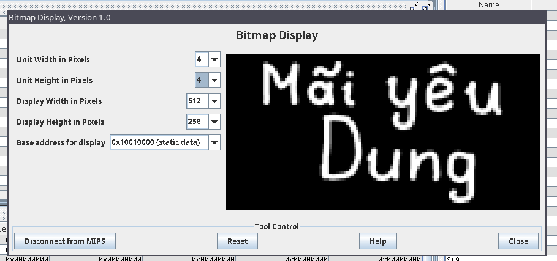

# Lab 10
## Bài 1. Hiện số trên led 7 thanh
- số `10`:
  - số `1` => `0b00000110` => `0x6`
  - số `0` => `0b01111111` => `0x3f`  
    
- số `88`:
  - số `8` => `0b01111111` => `0x7f`  
    
- số `2` => `0b01011011` => `0x5b`  
  
- số `3` => `0b01001111` => `0x4f`  
  
- số `4` => `0b01100110` => `0x66`  
  
- số `5` => `0b01101101` => `0x6d`  
  
- số `6` => `0b01111101` => `0x7d`  
  
- số `7` => `0b00000111` => `0x07`  
  
- số `9` => `0b01101111` => `0x5f`  
  

## Bài 2. Bitmap
- vẽ dòng chữ `Mãi yêu Dung`  
  
  

## Bài 3. Mars bot
- vẽ tam giác bằng mars bot  
  

## Bài 4. Keyboard exit
  
  
  
  
