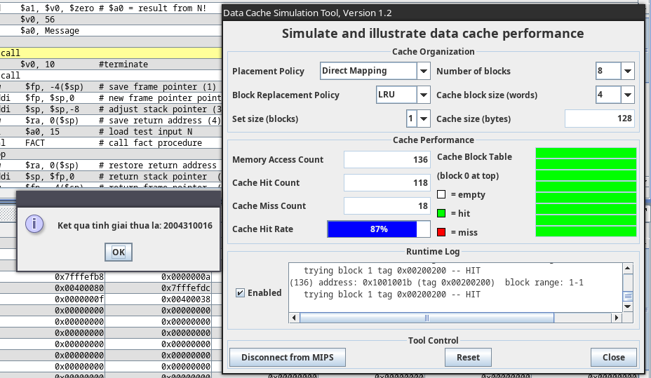
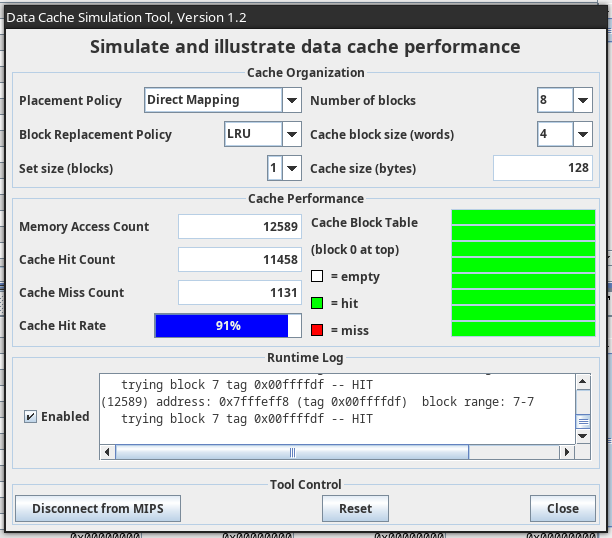
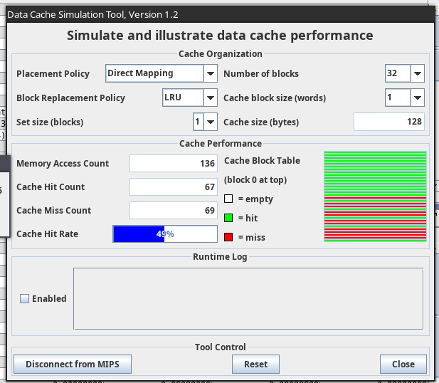
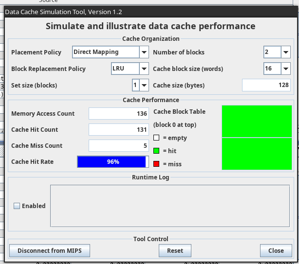
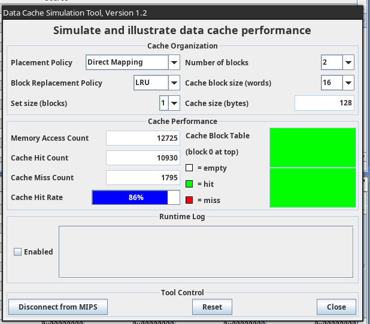
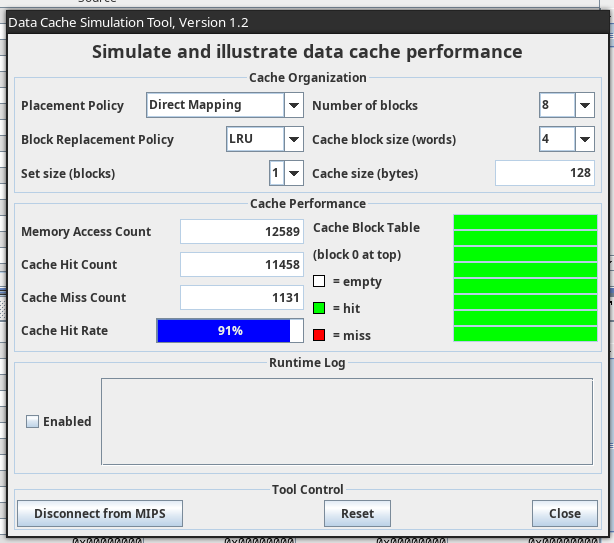
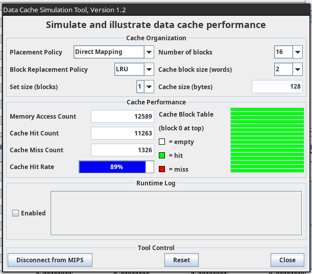
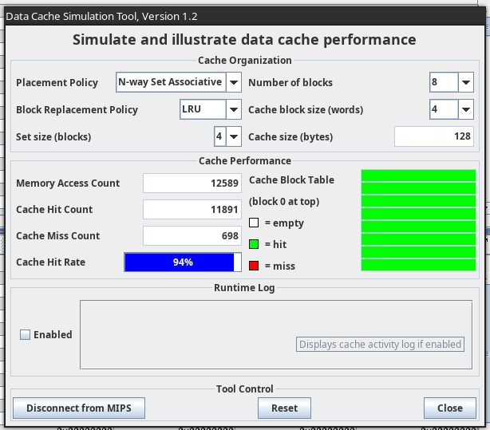
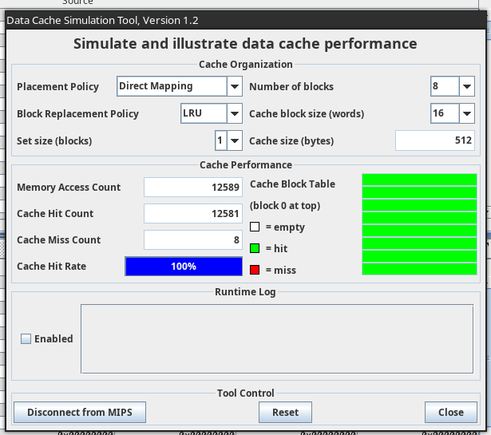

# Lab 12
## Assignment 1
- Sample Code 1  
  
- Sample Code 2  
  

## Assignment 2
### How is the 32-bit address used in the cache memory?
- 32 bit được chia làm 3 phần là tag, index và offset
- VD: direct-mapped cached có 8 blocks và 4 words mỗi block.
  - Với address: `0x7fffeff8` = `0b01111111111111111110111111111000`
  - 4 words = 16 bytes = 2^4 bytes => mất 4 bit offset
  - 8 blocks = 2^3 blocks => mất 3 bit index
  - còn lại 32 - 4 - 3 = 25 bit tag  
    ```
    0b0111111111111111111011111 111 1000
      ^^^^^^^^^^^^^^^^^^^^^^^^^ ^^^ ^^^^
           0x00ffffdf            7   8
    ```
  - `0x7fffeff8` => có index 7
  
### What happens when there is a cache miss?
- Ghi có đọc lại (write allocate): giá trị sẽ được ghi vào bộ nhớ và sau đó cả block sẽ được đưa vào cache
- Ghi không đọc lại (write non-allocate): giá trị sẽ chỉ được ghi vào bộ nhớ

### What happens when there is a cache hit?
- Ghi thẳng (write through): giá trị sẽ được ghi vào bộ nhớ cache và ghi vào bộ nhớ bên ngoài
- Ghi trễ (write back): giá trị sẽ được ghi vào cache và cả block chứa nó khi block đó bị thay thế thì nó mới ghi lại vào bộ nhớ ngoài

### What is the block size?
- Là số word trong mỗi block

### What is the function of the tag?
- Được dùng để kiểm tra một địa chỉ đã có trong cache chưa
- So sánh lần lượt từng bit của MSB với từng bit tương ứng của tag
- Nếu giống nhau hết thì trả về giá trị của địa chỉ đó trong cache
- Nếu khác thì là cache miss

## Assignment 3
### Sample code 1



### Sample code 2






### Explain
- Cache size càng lớn càng có nhiều index => giảm full set => tăng cache hit
- Block size càng lớn => ghi được nhiều address lân cận => tăng cache hit
- Num of set càng nhiều => tương đương block size càng lớn => ghi được nhiều address lân cận => tăng cache hit

### If a cache memory is so large that all the code of a loop fits into the cache memory, how many cache misses will occur during the execution of the loop? Is this good or bad?
- Toàn bộ code trong loop vừa với cache thì trong suốt quá trình lăp, không có việc truy cập đến vùng nhớ khác vùng nhớ xuất hiện trong loop => không xảy ra cache miss
- Chỉ tốt khỉ cache vừa phải, cache lớn quá sẽ gây lãng phí

### What should a code (i.e. program) look like to get the most benefit of a large block size?
- Sample code 2 sẽ phù hợp hơn, vì sử dụng stack nhiều, mà stack là vùng nhớ liền nhau nên block size lớn sẽ có lợi hơn
